# 👨‍💻 What's up? I'm Willian :]

**Senior PM & Builder** | OmniWave Group LLC 🇺🇸 | Brazil 🇧🇷

---

## 🎯 About Me

I'm a **Product, GenAI & Data Specialist** with 5+ years of experience as a Senior Product Manager at a LATAM bank. A tech enthusiast who builds real products — I founded **OmniWave Group LLC** to design and deliver SaaS solutions *from architecture to production*.

Every project here is a **complete product**: architecture, backend, frontend, deployment, and production maintenance. I work with **Django**, **Next.js**, **Astro**, **Node.js**, **Claude AI**, and modern stacks. I prefer simple, scalable, and direct solutions.

**Expertise:** Product Strategy | GenAI Integration | Data-Driven Decisions | Full-Stack Architecture

---

## 🏢 Projects

### 1. **XFiber Ops** — Operations Platform (Fiber Optic) 🇺🇸
*Tech consulting & SaaS for fiber optic installation*

**What it does:**
- CRM + Daily reports + Mobile check-in (GPS + selfie)
- Clock in/out with payroll dashboard
- Job mapping + tickets with Leaflet + OpenStreetMap
- i18n EN/ES/PT (localStorage)
- Support for in-house workers + subcontractors

**Stack:**
- **Backend:** Django 5 + PostgreSQL + REST Framework
- **Frontend:** HTMX + Alpine.js + Tailwind CDN (no build step)
- **Mobile:** PWA-ready, GPS + camera integration
- **Infra:** Railway (auto-redeploy) + SQLite (dev)
- **UI:** Brand navy #0F1B3D + orange #FF6B00, Figtree font

**Architecture:**

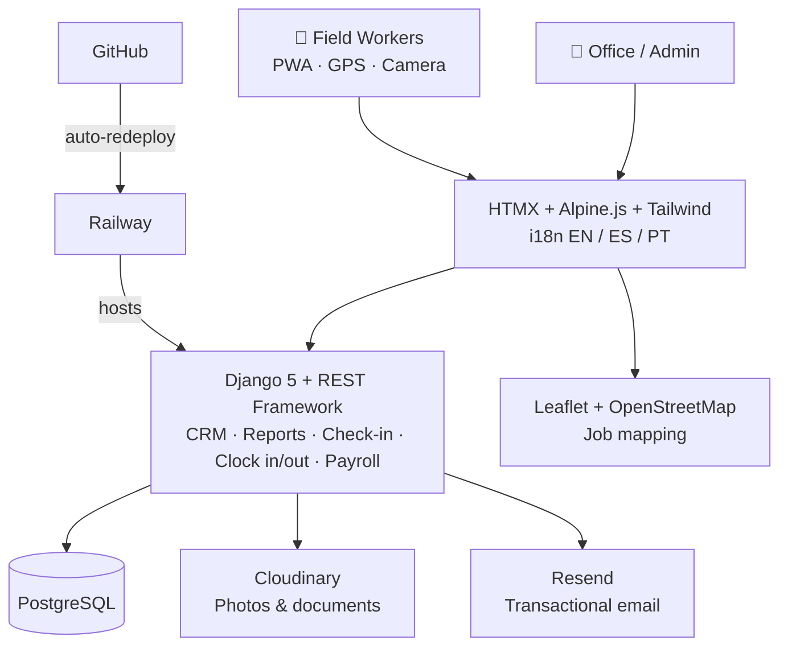

---

### 2. **Longavita** — Support Platform for Chronic Diseases 🇧🇷
*Community, information, health professionals & products for chronic disease management*

**What it does:**
- **Community/Forum** — Experience sharing between patients with protected identities (pseudonyms)
- **Chronic Disease Library** — Reviewed informative content about health conditions
- **Professionals Directory** — Specialists with 3 contact modes: direct contact, scheduling, telemedicine
- **Marketplace** — Curated showcase of products for quality of life
- **Blog** — Articles and news about chronic diseases
- **Backoffice (Django Admin)** — Team manages doctors, products, diseases & posts without programmer

**Stack:**
- **Backend:** Django 5 + PostgreSQL
- **Frontend:** HTMX + Alpine.js + CSS via CDN (no build step)
- **Infra:** Railway (auto-redeploy from GitHub)
- **Static Files:** WhiteNoise
- **UI:** Teal #0ea5a0 + Orange #f97316, Sora / Cormorant Garamond fonts

**Architecture:**

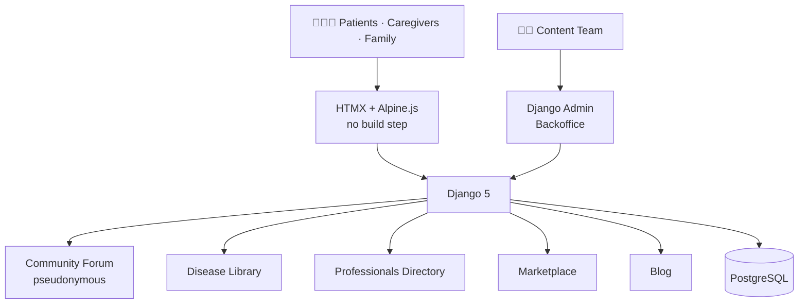

---

### 3. **Omniwave Energy** — Multi-niche Landing Platform 🇺🇸
*Landing page generator for solar, roofing, pool, plumbing*

**What it does:**
- Landing pages per niche (Solar active in Florida)
- Native i18n: PT (default), ES, EN
- Integration with leads API 
- Auto-generated sitemap
- SEO optimized

**Stack:**
- **Frontend:** Astro 4 + TypeScript + Tailwind
- **Infra:** Vercel (auto-deploy)
- **Backend integration:** Django REST API (Omniwave Ops)

**Architecture:**

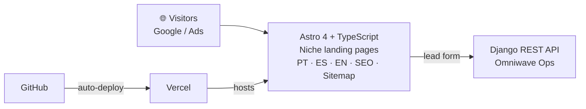

---

### 4. **Empireo** — Tax Filing Automation 🇧🇷
*Automated income tax for Brazilian freelancers earning in USD*

**What it does:**
- Dark & premium dashboard
- Accurate tax calculation with deductions
- Wise integration (OAuth)
- Tax form PDF generation
- Transaction history + reports

**Stack:**
- **Backend:** Django + Python
- **DB:** SQLite (dev), PostgreSQL (prod)
- **Tests:** pytest (14 tests covering all tax brackets)
- **Integration:** Wise API and other worldwide banks

**Architecture:**

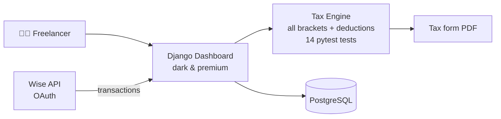

---

### 5. **WhatsApp Chatbot** — Multi-tenant with Claude AI 🇺🇸
*Chatbot platform for WhatsApp powered by AI — in production with 9 active clients*

**What it does:**
- Multi-tenant chatbot (each client is a tenant)
- Claude AI (Anthropic) as the brain
- Conversation history + automatic context reset
- Per-client usage dashboard
- **TCPA consent tracking** (US compliance)
- Multilingual commands (STOP / ATENDENTE / RESET), PT-BR default
- 7 WhatsApp utility templates + admin HTTP endpoint

**Stack:**
- **Backend:** Node.js + Express
- **DB:** Supabase (PostgreSQL)
- **AI:** Anthropic Claude API
- **Channel:** Meta Cloud API (official) — migrated from Evolution API
- **Infra:** Railway (~$10–15/month serving 10–15 conversations/day)

**In production:** 9 active clients (v2.3) — 24/7 support, automated FAQ, lead qualification.

**Architecture:**

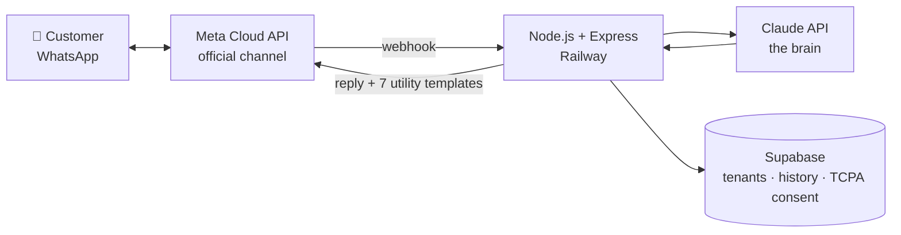

---

### 6. **AlertaMe** — Reminder Assistant via WhatsApp 🇧🇷 🇺🇸
*"Your family never forgets what matters" — Smart reminders in natural language*

**What it does:**
- **Natural language input** — "remind me to pay the electric bill on the 10th", "mom's appointment next Thursday at 8am", "daily medication at 8pm"
- **AI understands** — parses dates (relative like "next month"), times, recurrence patterns using Claude API
- **Auto-schedules** — creates structured reminders with date, time, recurrence
- **Responds in text + audio** — confirms reminder via message and voice notification at scheduled time
- **Family-focused** — each person identified by WhatsApp number; reminders can be shared
- **Personalization** — customizable assistant name, voice (male/female), conversation style

**Stack:**
- **Backend:** Django 5 + PostgreSQL
- **Infra:** Railway (auto-redeploy) + VPS Hetzner (Evolution API + Docker)
- **AI Brain:** Claude API (Anthropic) — natural language → structured reminders
- **Voice:** ElevenLabs TTS with audio caching
- **WhatsApp Channel:** Evolution API → Meta Cloud API (official), swappable via abstract channel interface
- **Frontend/Landing:** Static HTML/CSS/JS bilingual (PT/EN) on Vercel
- **Architecture:** Abstract `WhatsAppChannel` interface — swap Evolution for Cloud API with 1 config line

**Architecture:**

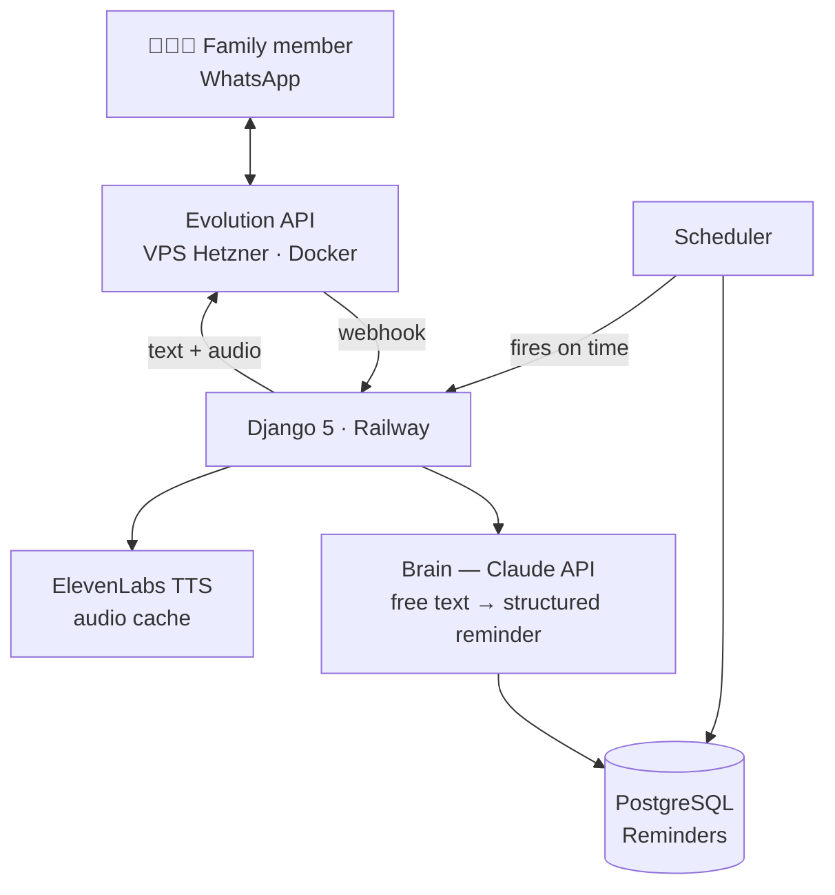

---

### 7. **LeadHaus** — Premium CRM for High-End Real Estate 🇧🇷
*Commercial management for luxury real estate brokers — "never let a hot lead go cold"*

**What it does:**
- **Smart pipeline** — visual kanban (New lead → Contact → Visit → Proposal → Closed)
- **Lead scoring** — surfaces who's hot right now (timing score 0–100) so the broker contacts the right person first
- **Client cards** — full history, property interests, and contact data **encrypted at rest**
- **Multi-channel capture** — WhatsApp, Instagram, Facebook, e-mail, referral feeding a single funnel
- **AI drafts** — suggested replies written in the broker's own tone of voice (Claude)
- **Deal Room** — secure space per transaction with document checklists + client access codes
- **VIP security** — encrypted sensitive fields, 2FA, restricted access for high-profile clients (executives, public figures, athletes)
- **Multi-tenant by design** — PostgreSQL Row-Level Security isolates each broker's portfolio at the database level

**Stack:**
- **Frontend:** Next.js 15 (App Router) + TypeScript + Tailwind
- **Backend:** Next.js Server Actions + Prisma ORM
- **DB:** PostgreSQL 16 with Row-Level Security (true multi-tenant isolation)
- **Auth:** Auth.js (NextAuth v5) + 2FA TOTP
- **AI:** Anthropic Claude API (zero-data-retention)
- **Channels:** Meta Cloud API (WhatsApp / Instagram / Facebook)
- **Infra:** Railway (auto-redeploy from GitHub) + managed PostgreSQL
- **UI:** Gold #C8A96B + Turquoise #5BC9B8 + Ivory, Cormorant Garamond / Inter / Helvetica Neue

**Target Audience:** High-end real estate brokers serving high-profile clients.

**Architecture:**

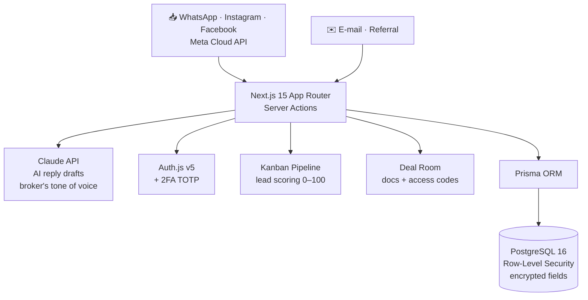

---

### 8. **CargoOps** — TMS for Transportation 🇧🇷
*"Never lose a shipment" — Transportation Management System for chemical & general cargo transporters*

**What it does:**
- **Real-time tracking** — Leaflet map with live vehicle positions, pulsing pins by status (en ruta/entregado/alerta)
- **Smart dispatching** — intelligent routing + load matching + OTD (On-Time Delivery) monitoring
- **Fleet management** — vehicle maintenance schedules, inspections, documents (RNTRC, CRLV)
- **Driver compliance** — exams (médico/psicológico), licenses, hours of service, alerting system
- **Tollway control** — detects when drivers forget to raise suspended axles on empty returns (saves company $)
- **CT-e integration** — tax invoice + routing data linked in one place
- **B2B quoting** — public form captures leads; inbox with quote requests
- **Executive dashboards** — revenue, OTD and average ticket KPIs fed by the client's monthly reports
- **Admin & reports** — compliance reporting, financial insights, fleet analytics

**Stack:**
- **Frontend:** Next.js 16.2.9 (App Router) + React 19 + Tailwind v4 (no config file, `@theme` in CSS)
- **Components:** shadcn/ui on **Base UI** (`@base-ui/react`, not Radix) + Lucide icons
- **Maps:** Leaflet + react-leaflet (CARTO tiles, no API key needed)
- **Data:** Supabase (PostgreSQL) — multi-tenant with Row-Level Security
- **Infra:** Vercel (auto-deploy from GitHub)
- **UI Style:** Salesforce Lightning theme — Charcoal + Orange, **desktop-first**

**Current Status:** In production with 3 logistics clients (chemical & general cargo, Brazil). Multi-tenant architecture. Build always passes.

**Architecture:**

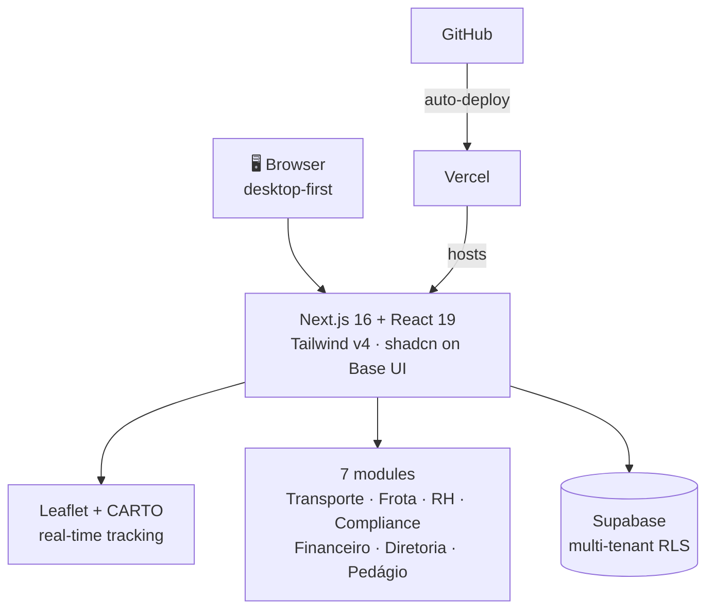

---

### 9. **DailyKids** — Kids' Routine & Home-Study Platform 🇧🇷
*Daily routine checklist + homeschool tracking for children — built for real family use*

**What it does:**
- **Daily routine checklist** — kid-friendly tasks with 6 color gradient themes and unisex doodle backgrounds (rocket, teddy bear, star, soccer ball...)
- **Family code access** — each family gets its own private space
- **Weekly study diary** — per-subject content notes with auto-calculated study hours
- **PDF portfolio report** — exportable homeschool documentation
- **Uppercase "print-style" letter mode** — toggle for early readers, saved per device
- **Offline queue** — task marking works without connection, syncs later
- **Smart day boundary** — logical day starts at 4am (not midnight), with automatic day-change detection
- **PWA on iPad** — installable with custom icons; primary device is a child's iPad

**Stack:**
- **Backend:** Fastify (Node.js) — single service serving static front-end + API
- **Frontend:** Vanilla HTML/CSS/JS — no bundler, no framework (deliberate minimal stack)
- **DB:** PostgreSQL (Railway plugin), stable string slugs as primary keys
- **Infra:** Railway (auto-deploy from GitHub)
- **Offline:** Service worker with versioned cache + localStorage queue

**Design philosophy:** Validated at home with a real kid — real daily usage drives the roadmap. Minimal stack over framework complexity.

**Architecture:**

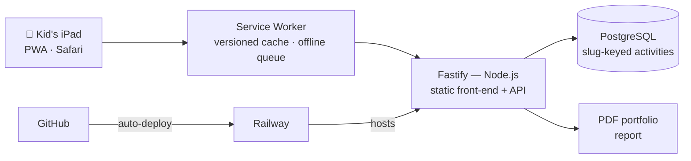

---

### 10. **SolarIQ** — Smart Platform for Solar Operations 🇺🇸
*AI + dashboards + automation for solar companies — turning complex data into faster decisions*

**What it does:**
- **Lead pre-qualification** — roof analysis via Google Solar API (DSM + aerial imagery), with a data-confidence "traffic light" and mandatory site survey when imagery is poor or the house is new
- **Post-sale operations core** — permit → installation → PTO pipeline management (the real differentiator vs. design-only tools)
- **3D roof context** — LIDAR-based roof model with neighborhood/street context built from Google Solar API dataLayers (no proprietary 3D engine)
- **AI-driven insights** — dashboards, analytics, and automations in a single platform

**Stack:**
- **APIs:** Google Solar API + Geocoding (Google Cloud project with active billing)
- **Strategy:** Don't compete with Aurora Solar on 3D modeling — win on operations
- **Market:** Florida, USA — distributed via the Omniwave Energy channel

**Architecture:**

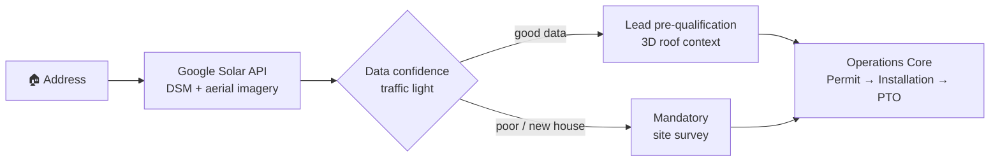

---

### 11. **DailyMaid** — Housecleaning Management Platform 🇺🇸
*Multi-channel operations for cleaning companies — schedule, teams, invoicing & WhatsApp-first communication*

**What it does:**
- **Board-style operations** — monday.com-inspired UI (boards, columns, colored statuses), white & clean with light blue accents
- **Daily cleaner alerts** — each cleaner receives the day's houses on her phone via WhatsApp (app as secondary channel)
- **Clock in/out** — geolocation + photo confirmation at each house
- **Client invoicing** — invoices with Zelle payment + automatic reminders
- **Full back office** — houses, finances, payments, expenses, cleaner/employee records
- **Simple weekly Schedule** — editable agenda built for non-technical managers
- **Guided onboarding** — "Let's get started" flow, English interface

**Architecture:**

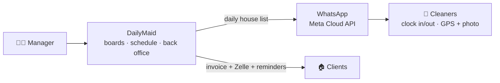

**Go-to-market:** US market (benchmarks: ZenMaid, Launch27, Housecall Pro). Founding client: Brazilian-owned cleaning company in the US, referring the platform onward.

---

### 12. **Pestana Management** — Construction PM Landing Page 🇺🇸
*Client work: digital presence for a Florida construction project management company*

**What it does:**
- **One-page professional site** — services, process, and portfolio for a construction project management firm (permits, inspections, supplier coordination, through to finished-home delivery)
- **Portfolio showcase** — 13+ homes managed as PM for builder clients
- **Lead capture** — contact section connected to the company's corporate e-mail
- **Custom domain & e-mail** — full domain + DNS + professional e-mail setup for the client

**Stack:**
- **Frontend:** Static landing page — HTML/CSS/JS, lightweight, fast, SEO-friendly
- **Infra:** Netlify (hosting, auto-deploy) + GoDaddy (domain, DNS, corporate e-mail)
- **Market:** Florida, USA

**Architecture:**

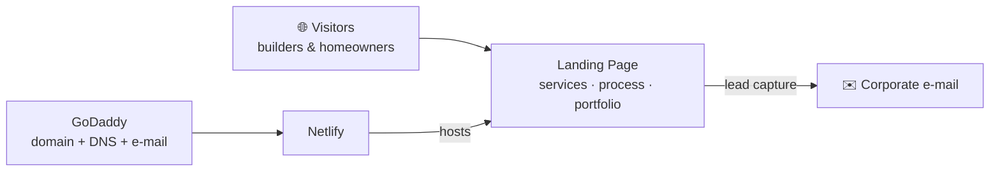

**Delivered:** Live for a Florida construction management client — part of Omniwave Group's client services arm.

---

## 📊 Production Numbers

| Project | Status | Users | Transactions | Uptime |
|---------|--------|-------|--------------|--------|
| **XFiber Ops** | 🟢 Live | 85 users | 1000+ checkins/month | 100% |
| **Longavita** | 🟢 Live | Growing | 100+ community posts/month | 100% |
| **Omniwave Energy** | 🟢 Live | — | 50+ leads/month | 100% |
| **LeadHaus** | 🟢 Live | 19 brokers | 300+ leads managed/month | 100% |
| **AlertaMe** | 🟢 Live | 26 | 50+ reminders/week | 99.8% |
| **WhatsApp Chatbot** | 🟢 Live | 11 clients | 10–15 conversations/day | 100% |
| **CargoOps** | 🟢 Live | 3 clients | 50+ shipments tracked/month | 100% |
| **DailyKids** | 🟢 Live | Active families | Daily routine + study tracking | 100% |
| **Empireo** | 🟢 Live | 5 users | Tax calculations + reports | 100% |
| **DailyMaid** | 🟢 Live | Founding client | Schedule · invoicing · WhatsApp alerts | 100% |
| **SolarIQ** | 🟢 Beta | — | Roof analysis + lead pre-qualification | 100% |
| **Pestana Management** | 🟢 Live | 1 client | Construction PM leads | 100% |

---

## 🎓 Methodology

- **Product-led:** Feature = problem solved
- **Fast iteration:** Waves = small deliveries (1-2 weeks)
- **Shipping mentality:** Deploy before perfect
- **Code-as-docs:** Detailed READMEs
- **No magic:** Django defaults, Tailwind core utilities, nothing fancy

---

## 💼 Availability

**Status:** Open to:
- ✅ Technical consulting (PM → architecture)
- ✅ Building custom SaaS
- ✅ Mentoring devs in product thinking
- ✅ Full-time corporate roles

**Contact:** LinkedIn or email (below)

---

## 📞 Contact

- **LinkedIn:** [linkedin.com/in/will-gouveia](https://linkedin.com/in/will-gouveia)
- **Email:** wgouveiaa@gmail.com
- **GitHub:** [@willgouveiaa](https://github.com/willgouveiaa)

---

## 📚 Published Works

### 📰 Featured In
- **Terra Economia:** [Como a liderança de Willian Gouveia de Aguiar gerou R$ 19 milhões e redefiniu a estratégia de dados no sistema bancário brasileiro](https://www.terra.com.br/economia/como-a-lideranca-de-willian-gouveia-de-aguiar-gerou-r-19-milhoes-e-redefiniu-a-estrategia-de-dados-no-sistema-bancario-brasileiro,91c344e4b4b4016a12721702b402c0df84vwq66c.html)

- **iG In Magazine:** [Willian Gouveia Aguiar & Machine Learning](https://inmagazine.ig.com.br/empreendedorismo/willian-gouveia-aguiar-machine-learning)

- **MSN Negócios & Tecnologia:** [Como Willian Gouveia de Aguiar lidera estratégias orientadas por dados e jornadas omnichannel no sistema financeiro](https://www.msn.com/pt-br/noticias/noticias/neg%C3%B3cios-e-tecnologia-como-willian-gouveia-de-aguiar-lidera-estrat%C3%A9gias-orientadas-por-dados-e-jornadas-omnichannel-no-sistema-financeiro/ar-AA1RWIBV?disableErrorRedirect=true&infiniteContentCount=0)

### 📖 Academic Articles
- **RCMOS Journal:** [Article #1881](https://submissoesrevistarcmos.com.br/rcmos/article/view/1881)
- **RCMOS Journal:** [Article #1880](https://submissoesrevistarcmos.com.br/rcmos/article/view/1880)

### 🏆 Awards & Recognition
- **IEEE Member** — Institute of Electrical and Electronics Engineers
- **RCMOS 2023 Cycle:** [Recognition & Award](https://submissoesrevistarcmos.com.br/rcmos/ciclo_2023)

---

## 🛠️ Tech Stack

### Backend & Languages

### Frontend

### Databases & Data

### Integrations & APIs

### DevOps & Hosting

---

## Complete Tech Stack Details

### Backend
- **Django 5** (Python) — XFiber Ops, Longavita, Empireo, AlertaMe
- **Node.js + Express** — WhatsApp Chatbot
- **Fastify (Node.js)** — DailyKids (single service: static front-end + API)
- **Next.js 15** (App Router + Server Actions) — LeadHaus
- **Next.js 16** (App Router) — CargoOps
- **REST APIs** — Inter-system integration

### Frontend
- **Next.js 16.2.9** (React 19) — CargoOps (TMS platform)
- **Next.js 15** (TypeScript) — LeadHaus (luxury CRM)
- **Astro 4** (TypeScript) — Omniwave Energy
- **HTMX + Alpine.js** — XFiber Ops, Longavita
- **Tailwind CSS** — All projects (v4 in CargoOps, v3 elsewhere)

### Databases
- **PostgreSQL** — XFiber Ops (Railway), Longavita (Railway), Empireo (Railway), AlertaMe (Railway), LeadHaus (Railway, with Row-Level Security), CargoOps (Supabase, multi-tenant RLS)
- **Prisma ORM** — LeadHaus, CargoOps
- **SQLite** — Local dev, fallback
- **Supabase** — WhatsApp Chatbot, CargoOps

### Integrations & APIs
- **Anthropic Claude API** — WhatsApp Chatbot, AlertaMe (brain), LeadHaus (AI drafts)
- **Meta Cloud API** — WhatsApp Chatbot (official channel in production), LeadHaus (WhatsApp / Instagram / Facebook), DailyMaid (WhatsApp-first)
- **Google Solar API + Geocoding** — SolarIQ (roof analysis, lead pre-qualification)
- **Evolution API** — AlertaMe (Phase 1 WhatsApp channel)
- **ElevenLabs API** — AlertaMe (voice synthesis with caching)
- **Wise API** — Empireo
- **Cloudinary** — XFiber Ops, Longavita (bill/document uploads)
- **Leaflet + OpenStreetMap/CARTO** — XFiber Ops, CargoOps (real-time tracking)
- **Resend** — XFiber Ops (transactional email)

### Auth & Security
- **Auth.js (NextAuth v5) + 2FA TOTP** — LeadHaus
- **PostgreSQL Row-Level Security** — LeadHaus, CargoOps (multi-tenant isolation)
- **AES-256-GCM encryption at rest** — LeadHaus (sensitive client data)

### Infra & DevOps
- **Railway** — XFiber Ops, Longavita, Empireo, AlertaMe, LeadHaus, DailyKids (deploy + auto-redeploy)
- **Vercel** — Omniwave Energy, CargoOps, AlertaMe landing page
- **Netlify** — Pestana Management (landing page, auto-deploy)
- **VPS Hetzner** — AlertaMe Evolution API (Docker, Ubuntu)
- **Google Cloud** — SolarIQ (Solar API + Geocoding, active billing)
- **GitHub** — Source of truth for all projects
- **Docker** (optional) — Containerization
- **Gunicorn + Whitenoise** — Production servers (Django projects)
- **PWA + Service Workers** — DailyKids (versioned cache, offline queue), XFiber Ops

### QA & Testing
- **pytest** — Empireo (14 tests), AlertaMe (webhook + brain tests)
- **Django TestCase** — XFiber Ops, Longavita, AlertaMe
- **Next.js build** — LeadHaus, CargoOps (lint + type-check)
- **Manual testing** — All projects

### Languages
- **Python** (Django) — Backend
- **TypeScript** — Next.js frontends (LeadHaus, CargoOps), Astro (Omniwave Energy)
- **JavaScript** — Frontend (Alpine.js, HTMX)
- **SQL** — Migrations, queries, RLS policies
- **Bash** — DevOps, scripts

---

## 🌟 Fun Facts

- 🇧🇷 Brazilian, based in São Paulo
- 🎯 Senior Product Manager (5+ years at LATAM bank)
- 🚀 Founder of OmniWave Group LLC in USA 🇺🇸
- 📱 Obsessed with onboarding & UX
- 🤖 GenAI enthusiast (Claude, LLMs, agents)
- 💻 Workbench: Mac + Claude Code + GitHub web
- 🎨 Navy #0F1B3D + Orange #FF6B00 = my palette

---

> **"Ship > Perfect"** — Always.
